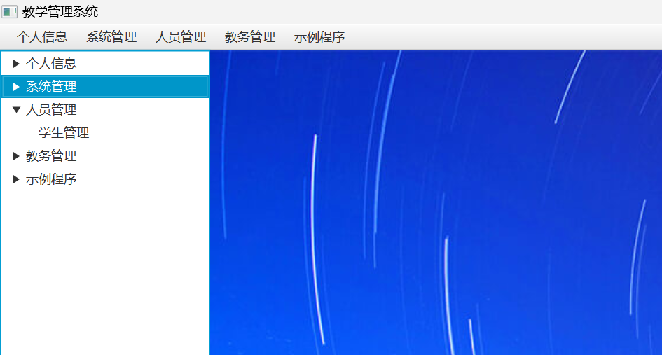
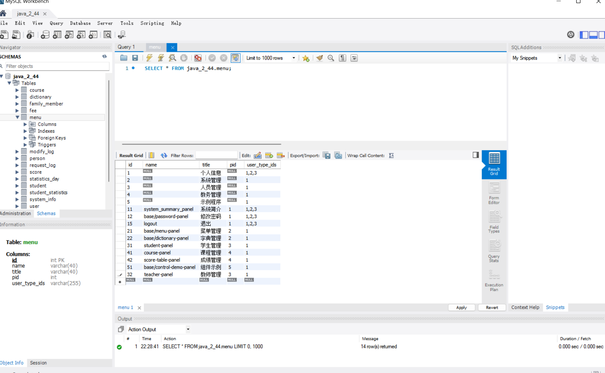
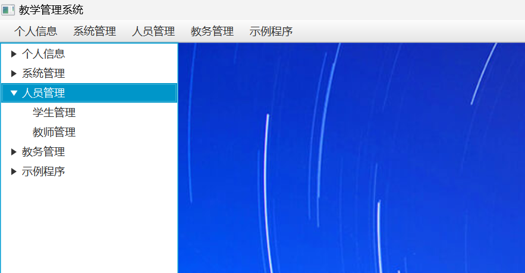
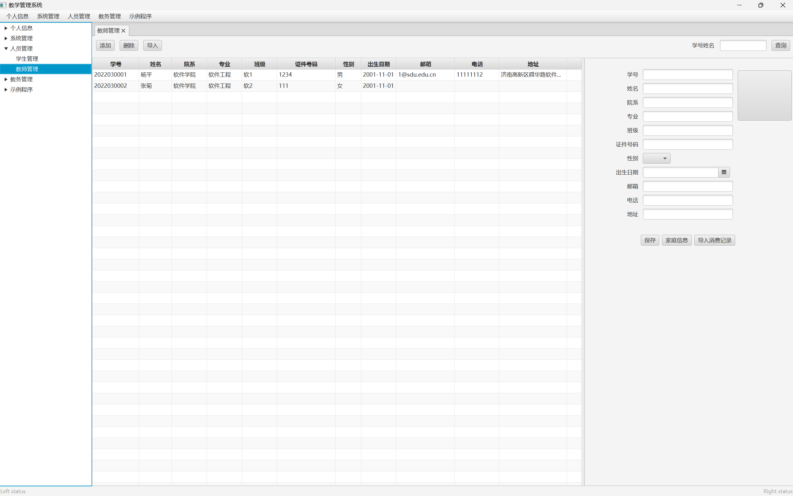

# Java课设 管理信息系统
## 需要完成的功能（包括但不限于，以学生管理系统为例）
#### （1）学生基本信息、联系方式、入学前信息、家庭信息、社会关系等基本信息的增删改查。
#### （2）学习信息管理，包括课程基本信息，课程中心（教材、课件、参考资料等）选课信息、考勤信息、作业信息、成绩信息的增删改查
#### （3）学生社会实践、学科竞赛、科技成果、培训讲座、创新项目、校外实习等创新实践信息的增删改查
#### （4）学生荣誉信息管理，包括获得的各种称号奖励等信息的增删改查
#### （5）学生体育活动、外出旅游、文艺演出、聚会、等日常活动信息的的增删改查。
#### （6）学生外出请假信息和生活学习消费等日志信息的增删改查
#### （7）学生创新成果、外出请假等审批流程（业务流程）
#### （8）学生各类信息数据统计 （数据统计）
#### （9）学生角色的增删和权限的分配（角色）

## 前期准备
#### （1）环境配置
#### （2）确定系统的名称、应用场景和角色和功能，功能的设计可参考上面功能结合项目的实际业务需求确定
#### （3）熟悉前后端的项目结构和代码，后端为主要，有时间可以丰富前端界面
## 需要学习哪些知识

#### （1）了解项目结构
#### （大致理解，后面会有一个教师管理的例子可能更清楚直观的能感受到）.fxml文件决定页面的样式，包括每个地方的大小和高度，前端中的controller控制前端数据给后端的controller发送请求，services中接受后，从数据库中进行查询，由repository中的方法来封装(Map或者MapList)数据返回给前端，前端最终呈现在页面上。（大部分也只需要在提到的这些文件夹里增加修改代码）

#### （2）前端
#### XML  开发指南里有建议可以在SceneBuilder中进行修改，对照，学习（刚开始可以先不管，主要是后面美化界面用的，可以先用老师发的样例）  [XML教程](https://www.runoob.com/xml/xml-intro.html)
#### 对于前端的controller
#### （3）后端

#### java中Map List Option类（主要），如果对java的基础语法不太熟->[java从入门到出门](https://365.kdocs.cn/l/ckJzzOPNFvxf?openfrom=docs) 
#### 注意在开发的过程中大部分时间只需要手写上面三个类的方法，此文档可以用来查缺补漏，不需要全部看完可以在开发的过程中进行复习
#### JPA的方法的详解（先理解6.3.4的内容即可） [JPA教程](https://docs.spring.io/spring-data/jpa/docs/2.5.3/reference/html/#jpa.query-methods.at-query)

#### （4）数据库
#### 不需要太深入学习sql语句，因为MySql可以直接增删改查（手动操作），如果想学的话->[SQL入门](https://365.kdocs.cn/l/clkhwerkOWvw?openfrom=docs)

### 例：添加教师管理(在人员管理中添加教师管理并且可以进行一些操作)

#### 首先在数据库中创建一个teacher-panel 注意学生管理是31，那教师管理可以设置成32，注意名字的书写很重要对于，尽量规范，最后一栏1，2，3分别表示权限是管理员，学生，老师，填写好后点击Apply可以看到SQL语句，点Apply即可
#### 重启javafx就可以看到已经添加成功了，但是点击之后前端会报错因为前端的页面还没有配置
#### 先处理后端：先在models中新建一个Teacher
#### 在repositorys中创建TeacherRepository
#### 在services中创建TeacherService
#### 在controllers中创建TeacherController(后端改好了但是太长了就不放这里了)
#### 再处理前端：在com.teach.javafx中创建teacher-panel.fxml，是教师管理的页面的书写，这里效仿学生管理的界面
#### 在前端的controllers中创建TeacherController
#### 最终的效果（懒得改前端代码了，直接用的学生管理的额代码所以信息是一样的）

### 可以先对照student的各部分代码进行学习，能看懂之后再创建教师管理，再做其他的功能

### 一些补充
#### 如果想要详细理解springboot中的项目结构->[基于springboot的web应用的快速入门](https://365.kdocs.cn/l/cn24dHuJNqoa?openfrom=docs)
#### 开发说明：
**（1）数据的持久性存储，数据库管理系统，可使用Mysql数据库进行数据的存储，每个团队配置一个Mysql数据库，基础数据库已经为项目的开发提供的基础的表设计和测试数据。数据库的命名规范：教学1班 团队01 的数据库名称为java_1_01, 用户名为java_1_01, 缺省密码为JavaP01@
（2）系统服务端程序基于String Boot3的JPA技术进行开发，java-server工程已经为项目搭建了基础框架，主要实现了基于JPA的数据库访问、支持前端Http请求的Web服务、包括用户登录、角色管理、权限管理、菜单管理、数据字典管理等基础功能实现、提供了学生管理功能后台数据Web服务的示例代码，和包括图形上传下载，Excl上传下载实现，学生可根据需求设计相关数据库表，创建响应model,repository, control等类设计相关的属性和方法，完成Project的开发目的后端业务模块的编程实现。
（3）系统前端程序基于Java FX，JXML等 技术进行开发， javafxclient工程已经为项目前端程序搭建了基础框架，主要实现了登录界面、系统主框架界面，主框架包括菜单栏和基于标签页的工作空间的管理，可以实现选择菜单到功能面板到工作空间窗口的装载和切换，实现了前端程序与后端java-server程序进行数据通讯的实现，实现了基本的菜单管理、数据字典管理等基本数据管理，提供了学生基本信息维护功能，学生可在此开发框架的基础上，通过菜单管理功能或者手工添加代码增加菜单项、手工编辑或者通过可视化的设计工具SceneBuilder编辑设计一个描述功能面板的FXML文件，创建交互控制Controller类，实现一个项目前端功能开发，配合java-server后端业务的设计开发，完成整个项目的设计。
（4）开发环境为IDEA
	开发团队要求
4-5人组队分工协作。
	考核方式
Java课程设计上机共15周，共48小时。计分方式：
1）	项目开发报告（20分），学生提交相关内容，由系统自动生成。
2）	系统运行演示验收（标准分：80分），以组为单位检查，按照下述系统检查标准打分。
3）	每个组员依据开发过程的工作贡献确定个人的得分权值（小组自己讨论确定），系统检查的同时提交给老师。策略为：假设本组最终成绩总为90（系统运行+源代码+开发报告），五个小组成员完成，每个人的贡献比例为：1、1、1.2、0,9、0.9（总和必须为5）。则五个同学的得分为90、90、100（90*1.2=108，封顶取分100）、81、81。
4）	系统检查时间：小组可在实验课结束规定时间内任意时间提交（注：提交是一次性的，不可撤回）
系统检查标准（80分）：
	系统的基本功能点（增删改查）至少8个以上，复杂数据统计功能、新增角色权限管理功能、申请审批业务流程、其他复杂功能等每个功能记作2个基本功能：40分（功能缺少酌情扣分）。 
	从功能实现体现出数据库设计能力，比如实体-关系的灵活运用，跨表实现功能需求：20分（只完成系统最基本数据表设计10分）。
	系统设计：20分（后端设计突破原有框架设计，有自己的独特性，系统运行流畅、无Bug出现，系统总体设计合理、规范性）。
     项目成绩组成： （系统检查+源代码）（80）+项目开发报告（20）
	  最后总成绩：项目成绩*0.96+个人表现。
     百分制按照五级标准转换为：优、良、中、及格、不及格提交教务**